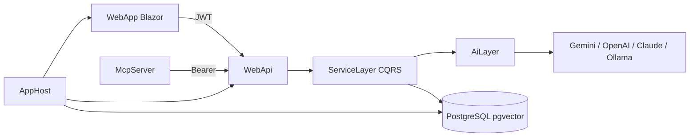

# Task Manager — .NET AI Demo

A full-stack **task manager** used to demonstrate practical **AI engineering with .NET**: LLM integrations, embeddings/RAG, Knowledge Lab, voice commands, agents, and MCP — on top of a clean Blazor + ASP.NET Core architecture.

> Demo / portfolio project, not a production SaaS product.

## What this showcases

| Area | Implementation |
|------|----------------|
| Summarization | Short AI summaries of task descriptions |
| Classification | Priority suggestions (guardrails + confidence) |
| Embeddings | Local **ONNX** `bge-small-en-v1.5` (384-d) → **pgvector** |
| Semantic search | Similarity search over todo embeddings (optional hybrid + RRF) |
| RAG | Natural-language Q&A over the user’s tasks (grounded / refuse-empty) |
| Advanced RAG | **Knowledge Lab** — upload docs, chunk + embed, scoped Ask with RAG trace |
| Function calling | Propose ≠ execute tool actions against the API |
| Voice | Hold-to-talk STT (Web Speech / local Whisper) → same tool pipeline |
| Agents (MAF) | **Microsoft Agent Framework** Analyst → Planner sprint workflow |
| MCP | Standalone MCP server for Claude Desktop |
| Multi-provider LLMs | Google Gemini, OpenAI, Azure OpenAI, Claude, Ollama |

UI: MudBlazor Blazor WASM (todos, sprints, AI Chat, Knowledge Lab, voice). Orchestration: **.NET Aspire** (Postgres + WebApi + WebApp + optional Speaches/Whisper).

## Architecture

```
src/
├── WebApp/           # Blazor WASM (MudBlazor, Auth0, Rx state)
├── WebApi/           # ASP.NET Core API (JWT, Swagger, SignalR)
├── AiLayer/          # Pipelines: summarize, classify, embed, RAG, SK tools
├── ServiceLayer/     # CQRS handlers (MediatR), agents, queues
├── DataLayer/        # EF Core + PostgreSQL / pgvector
├── Core/             # Domain, abstractions
├── ViewModel/        # Commands, DTOs, FluentValidation
├── McpServer/        # MCP stdio server → WebApi
├── AppHost/          # .NET Aspire orchestrator
└── ServiceDefaults/  # Health, OTel, resilience
```



**Stack highlights:** .NET 10, CQRS + MediatR, Auth0, EF Core, Semantic Kernel / Microsoft Agent Framework, Aspire.

## Quick start

**Prerequisites:** .NET 10 SDK, Docker (for Postgres via Aspire), Auth0 app configured, an LLM API key.

```bash
# 1) AI key (WebApi user secrets)
cd src/WebApi
dotnet user-secrets set "Ai:GoogleAI:ApiKey" "your-key"

# 2) Local embedding model (once)
./scripts/download-bge-onnx.sh

# 3) Run everything
dotnet run --project src/AppHost/AppHost.csproj
```

| App | URL |
|-----|-----|
| WebApp | https://localhost:5002 |
| WebApi / Swagger | https://localhost:5001/swagger (or http://localhost:5000) |
| Aspire dashboard | opened by AppHost |
| pgAdmin (optional) | http://localhost:5050 |

Without Aspire: `docker compose up -d` (Postgres on **5433**), set `ConnectionStrings:MainDb` in WebApi user secrets, then run WebApi + WebApp separately.

## AI features (in the UI)

- **Todos** — create/edit tasks; AI summary + priority classification; semantic search toggle; hold-to-talk voice overlay (STT → tools)  
- **AI Chat** — Ask (RAG over todos), Tools (function calling), Optimize Sprint (**MAF** multi-agent)  
- **Knowledge Lab** — upload `.txt`/`.md`, ingest/chunk/embed, scoped document Ask with retrieval trace  
- **Sprints** — list/detail of agent-created sprint plans  

Feature flags live under `Ai:Features` in [`src/WebApi/appsettings.json`](src/WebApi/appsettings.json) (`EnableSummarization`, `EnableEmbeddings`, `EnableRag`, `EnableKnowledgeRag`, `EnableFunctionCalling`, `EnableVoiceTranscription`, `EnableAgents`, …).

Implementation notes: [`docs/AI_FEATURES.md`](docs/AI_FEATURES.md).

## AI observability (OpenTelemetry)

AI features emit GenAI-oriented traces and metrics on ActivitySource/Meter `TaskManager.Ai` (classify, summarize, RAG, tools, embeddings, sprint optimizer).

| Environment | Where to look |
|---|---|
| **Development (Aspire)** | Aspire Dashboard → Traces / Metrics. Filter for `ai.operation/*`, `ai.llm/*`, `ai.tool/*`. |
| **Production** | Point `OTEL_EXPORTER_OTLP_ENDPOINT` at Grafana Alloy/Tempo (or any OTLP collector). Same instrumentation; no Aspire Dashboard required. |

Config under `Ai:Observability`:

- `Enabled` — master switch  
- `CapturePayloadPreview` — off by default; when on, truncated prompt/response previews may appear on spans  
- `RecordTokenUsage` — records provider token counts when available (often missing for Ollama)

Quality metrics on the same meter: `ai.quality.events` (validation_failed, insufficient_context, tool_arg_rejected, budget_exceeded, ungrounded_answer) and `ai.classify.override_decisions` (band × overridden).

## AI validation and evaluation

**Realtime (every request):** deterministic C# gates — input sanitize, schema/arg validation, RAG refuse-on-empty + Guid grounding, tool allowlist + status allowlist, sprint tool/time budgets. LLM-as-judge is **not** on the hot path.

**Offline eval fixtures:**

| File | Purpose |
|------|---------|
| [`samples/ai-eval-todos.csv`](samples/ai-eval-todos.csv) | Classify accuracy (`ExpectedPriority`) |
| [`samples/ai-eval-rag.json`](samples/ai-eval-rag.json) | RAG Triad fixtures (recall / insufficient) |
| [`samples/ai-eval-tool-proposals.json`](samples/ai-eval-tool-proposals.json) | Tool name + arg schema fixtures |

Harness code lives under `src/AiLayer/Evaluation/`. Unit tests in `AiLayer.Tests` run with mocks. For a live LLM classify pass:

```bash
export AI_EVAL_LIVE=1
# then run a small console/script that calls ClassificationPipeline per CSV row
dotnet test src/Tests/AiLayer.Tests --filter ClassificationAccuracyHarness
```

Agent budgets (`Ai:Agents`): `MaxToolInvocationsPerJob` (12), `MaxPlannerRecoveryPasses` (1), `JobTimeoutSeconds` (240), plus existing `StuckAfterSeconds` (300).

## MCP (Claude Desktop)

Standalone process in `src/McpServer` (stdio). Auth: Auth0 **Device Code** + refresh token (no pasted JWT). Tools: `create_todo`, `update_todo`, `search_todos`, `analyze_workload`.  
Setup: [`docs/mcp/README.md`](docs/mcp/README.md).

## Configuration notes

- Secrets via **user-secrets** / env vars — never commit keys.  
- Aspire injects `ConnectionStrings__MainDb`; don’t run Compose Postgres and Aspire Postgres together unless intentional.  
- Prefer `Ai:Agents:ChatModel` = `gemini-2.5-flash` (or OpenAI) for tool-calling agents.  
- More Aspire detail: [`docs/aspire/README.md`](docs/aspire/README.md).

## License

Demo / learning project. Use and adapt as needed for interviews, workshops, and portfolio demos.
